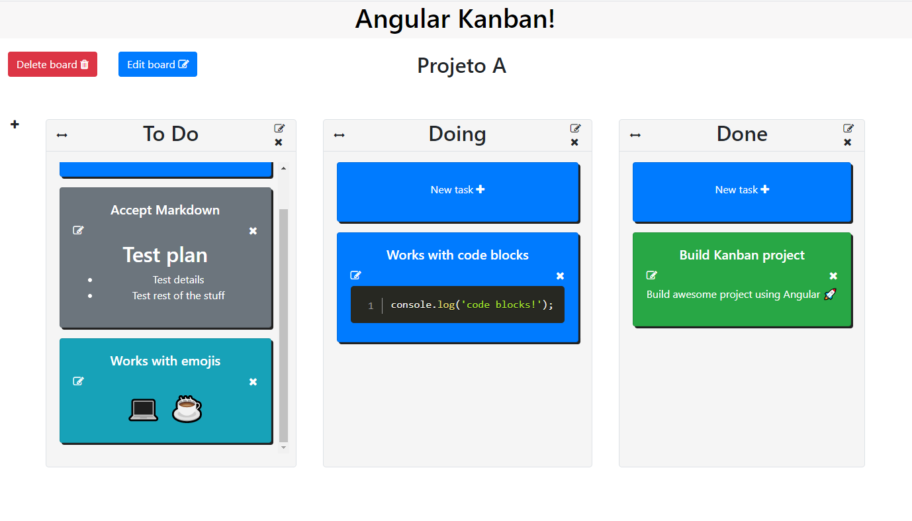

# Angular Kanban

Angular application for projects management with boards and tasks, similar to Trello and Jira. It's possible to create many boards, each can contain as many tracks and tasks as it seems necessary. Tracks and task can be dragged and dropped and tasks accept markdown and emojis. Everything is saved at the local storage.

This project was generated with [Angular CLI](https://github.com/angular/angular-cli) version 8.0.4.

## Development server

Run `npm start` for a dev server. Navigate to `http://localhost:4200/`. The app will automatically reload if you change any of the source files.